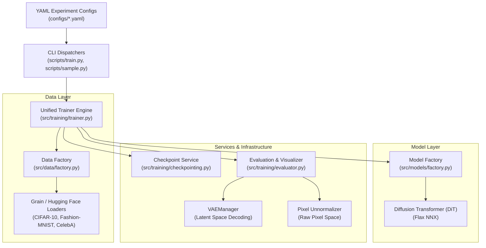

# LDMAX: Latent Diffusion Models in JAX


**LDMAX** is an educational, modular, and high-performance research codebase for training and sampling from **Diffusion Transformers (DiT)** from scratch in the modern JAX ecosystem.

---

## 🌟 Architecture & Core Principles

LDMAX is built on a **Clean Architecture** with strict separation of concerns across dataset pipelines, model architectures, training orchestration, and evaluation services:



### Key Technologies
- **Core Framework**: JAX (`jax`, `jax.numpy`), JIT compilation (`jax.jit`).
- **Model Definition**: **Flax NNX** (`flax.nnx`), the reference-based object-oriented API for Flax.
- **Optimization**: Optax (`optax`) with AdamW and EMA weight tracking.
- **Checkpointing**: Orbax (`orbax.checkpoint`) with async saving and GCS synchronization.
- **Data Loading**: Google Grain (`grain.python`) for high-throughput sharded pipelines (CIFAR-10, CelebA), alongside Hugging Face `datasets` / NumPy in-memory iterators (Fashion-MNIST).
- **Precision**: Mixed-precision support with `bfloat16` and explicit FP32 parameter and schedule management for TPU/GPU execution.

---

## 📁 Repository Structure

```text
ldmax/
├── configs/               # YAML experiment configurations
│   ├── celeba*.yaml       # CelebA latent-space configurations (256x256 -> 32x32 latents)
│   ├── cifar10*.yaml      # CIFAR-10 latent & native-pixel configurations
│   └── fashion_mnist*.yaml# Fashion-MNIST raw-pixel configurations (28x28 grayscale)
├── docs/                  # Specs, design documents, and research notes
├── scripts/               # Thin CLI entry points
│   ├── train.py           # Unified training CLI
│   ├── sample.py          # Unified standalone sampling CLI
│   ├── train_cifar10.py   # CIFAR-10 training launcher
│   ├── train_fashion_mnist.py # Fashion-MNIST training launcher
│   ├── train_celeba.py    # CelebA training launcher
│   └── demo.py            # Unified multi-dataset tabbed Gradio demo
├── src/                   # Core library code
│   ├── data/              # Dataset sources and factory
│   │   ├── celeba.py      # CelebA Grain pipeline
│   │   ├── cifar.py       # CIFAR-10 Grain pipeline
│   │   ├── fashion_mnist.py # Fashion-MNIST pipeline
│   │   └── factory.py     # Unified DataLoaderBundle & metadata factory
│   ├── models/            # Model architectures and factory
│   │   ├── dit/           # DiT & AdaLN-Zero blocks
│   │   └── factory.py     # Unified create_model factory
│   ├── sampling/          # Sampling utilities & offline generation
│   │   └── generator.py   # Unified standalone image generator
│   ├── training/          # Training infrastructure & services
│   │   ├── checkpointing.py # State validation & Orbax restore services
│   │   ├── ema.py         # Exponential Moving Average manager
│   │   ├── evaluator.py   # Sampling evaluator & grid visualizer
│   │   ├── sampler.py     # DDIM sampling engine
│   │   ├── step.py        # JIT training step & MSE loss computation
│   │   └── trainer.py     # Unified config-driven Trainer engine
│   └── utils/             # Utilities (checkpoint, config, logging, RNG, VAE)
├── tests/                 # Unit & integration tests
│   ├── unit/              # Unit tests for models, factories, checkpointing, trainer
│   └── integration/       # End-to-end integration tests
└── pyproject.toml         # Project configuration and linter settings
```

---

## 🛠️ Installation

```bash
# 1. Create and activate conda environment
conda create -n ldmax python=3.11 -y
conda activate ldmax

# 2. Install dependencies for your target hardware:
# CPU:
pip install -r requirements_cpu.txt
# GPU (CUDA):
# pip install -r requirements_gpu.txt
# TPU:
# pip install -r requirements_tpu.txt
```

---

## 🏃‍♂️ Quickstart Workflows

### 1. Training

Run training across any dataset using the unified entry point:

```bash
# Unified Training CLI
PYTHONPATH=. python scripts/train.py \
    --config configs/cifar10_pixel.yaml \
    --output_dir outputs/cifar10_run

# Fashion-MNIST Raw-Pixel Diffusion (28x28 Grayscale)
PYTHONPATH=. python scripts/train_fashion_mnist.py \
    --config configs/fashion_mnist.yaml \
    --output_dir outputs/fashion_mnist_run

# CIFAR-10 Native-Pixel Diffusion (32x32 RGB)
PYTHONPATH=. python scripts/train_cifar10.py \
    --config configs/cifar10_pixel.yaml \
    --output_dir outputs/cifar10_pixel_run

# CelebA Latent Diffusion (256x256 -> 32x32 Latents with VAE)
PYTHONPATH=. python scripts/train_celeba.py \
    --config configs/celeba.yaml \
    --output_dir outputs/celeba_run
```

#### Resuming Training
To resume training seamlessly from an existing run or specific checkpoint step:

```bash
PYTHONPATH=. python scripts/train.py \
    --config configs/cifar10_pixel.yaml \
    --resume_from outputs/cifar10_run \
    --output_dir outputs/cifar10_resumed
```

---

### 2. Standalone Sampling

Generate visual sample grids from a trained checkpoint or EMA weights:

```bash
# Unified Sampling CLI
PYTHONPATH=. python scripts/sample.py \
    --config configs/cifar10_pixel.yaml \
    --checkpoint outputs/cifar10_pixel_run/checkpoints/5000 \
    --num_samples 16 \
    --class_id 3 \
    --output_path samples/cifar10_class3.png

# Attribute-Conditioned CelebA Sampling
PYTHONPATH=. python scripts/sample.py \
    --config configs/celeba.yaml \
    --checkpoint outputs/celeba_run/checkpoints/50000 \
    --num_samples 16 \
    --attribute_names "Smiling,Eyeglasses" \
    --output_path samples/celeba_custom.png
```

---

### 3. Monitoring & Visual Evaluation

Launch TensorBoard to monitor live loss curves and generated sample grids:

```bash
tensorboard --logdir outputs
```

---

### 4. Interactive Demos

Launch the interactive Gradio browser demo to generate and blend classes or facial attributes across datasets in dedicated tabs:

```bash
# Launch unified multi-dataset tabbed demo (CIFAR-10, Fashion-MNIST, CelebA)
PYTHONPATH=. python scripts/demo.py \
    --cifar10-config configs/cifar10_pixel.yaml \
    --fashion-config configs/fashion_mnist_tpu_v4.yaml \
    --celeba-config configs/celeba.yaml \
    --celeba-checkpoint gs://diffjax/models/celeba_ldm_ccond_tpu-v6e-1_18-08-2026/checkpoints/270000 \
    --port 7860
```

---

## 🧪 Testing & Verification

LDMAX includes a comprehensive test suite verifying factories, checkpoint serialization, state management, model outputs, and end-to-end training runs:

```bash
# Run unit and integration tests
JAX_PLATFORMS=cpu PYTHONPATH=. pytest tests/

# Run code linter
ruff check .

# Run code formatter check
ruff format --check .
```

---

## 📚 References

- **Scalable Diffusion Models with Transformers (DiT)** ([Peebles & Xie, 2023](https://arxiv.org/abs/2212.09748))
- **Flax NNX** ([Documentation](https://flax.readthedocs.io/en/latest/nnx/index.html))
- **Google Grain** ([Repository](https://github.com/google/grain))
- **Orbax Checkpoint** ([Documentation](https://orbax.readthedocs.io/))
